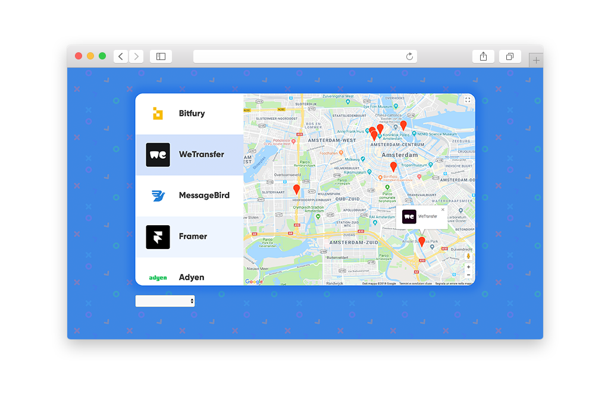

# 
 Startups Locator - App 

Single page application - in Vue.js - featuring a map of Amsterdam that highlights the exact location of promising startups in the area. Integrates various data points from the Google Maps API and the Lever API.

An MVVM pattern is implemented (through ES6 and Vue.js) to create a reactive application able to handle the various functionality: list, filters, and information on the page subject to changing state.

### See for yourself

Open `index.html` to try out the app.
